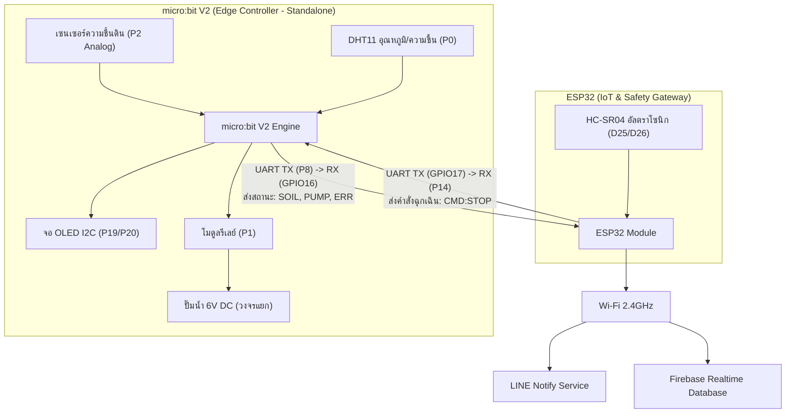

# Smart Auto-Watering & LINE Alert System (water_iot)

[](https://opensource.org/licenses/MIT)
[](https://microbit.org/)
[](https://espressif.com/)
[](https://firebase.google.com/)
[](https://notify-bot.line.me/)

โครงงานระบบรดน้ำแปลงเกษตรอัตโนมัติความเสถียรสูงและแจ้งเตือนผ่าน LINE ออกแบบตามหลักการวิศวกรรม IoT และสถาปัตยกรรมแยกส่วน (Hierarchical Edge-Gateway Architecture) สำหรับนวัตกรรมระดับมัธยมศึกษาและเกษตรอัจฉริยะต้นแบบ

---

## 📋 สารบัญเนื้อหา (Table of Contents)
1. [ภาพรวมของระบบ (Project Overview)](#-ภาพรวมของระบบ-project-overview)
2. [สถาปัตยกรรมระบบและหลักการทำงาน (System Architecture)](#-สถาปัตยกรรมระบบและหลักการทำงาน-system-architecture)
3. [ตารางการต่อวงจรและผังสายสัญญาณ (Hardware Wiring & Pinout)](#-ตารางการต่อวงจรและผังสายสัญญาณ-hardware-wiring--pinout)
4. [คู่มือความปลอดภัยวงจรไฟฟ้า (Electrical Safety Guide)](#-คู่มือความปลอดภัยวงจรไฟฟ้า-electrical-safety-guide)
5. [โครงสร้างโค้ดและการทำงาน (Firmware Details)](#-โครงสร้างโค้ดและการทำงาน-firmware-details)
6. [การตั้งค่าระบบคลาวด์และแจ้งเตือน (Cloud & Alert Setup)](#-การตั้งค่าระบบคลาวด์และแจ้งเตือน-cloud--alert-setup)
7. [การปรับจูนและทดสอบเซนเซอร์ (Calibration & Testing)](#-การปรับจูนและทดสอบเซนเซอร์-calibration--testing)
8. [โครงสร้างโปรเจกต์ (Repository Structure)](#-โครงสร้างโปรเจกต์-repository-structure)

---

## 🌟 ภาพรวมของระบบ (Project Overview)

ระบบรดน้ำแปลงเกษตรอัจฉริยะนี้ได้รับการออกแบบเพื่อแก้ปัญหาจุดบกพร่องทั่วไปของระบบ IoT นักเรียน (เช่น บอร์ดค้างเมื่อต่อปั๊มน้ำตรง, เน็ตหลุดแล้วระบบไม่รดน้ำ, น้ำล้นแปลง หรือปั๊มไหม้เมื่อน้ำหมดถัง) โดยแยกภาระงานออกเป็น 2 ชั้น:

1. **Edge Controller (micro:bit V2):** ทำหน้าที่เป็นสมองกลหลักในระดับแปลงเกษตร ทำงานแบบ Local Standalone ตรวจจับความชื้นในดิน อุณหภูมิ/ความชื้นอากาศ แสดงผลผ่าน OLED และควบคุมรีเลย์เปิด-ปิดปั๊มน้ำ แม้ไม่มีสัญญาณอินเทอร์เน็ตระบบก็ยังคงรดน้ำได้ 100%
2. **IoT Gateway (ESP32):** ทำหน้าที่เป็นสะพานเชื่อมต่อเครือข่ายความเร็วสูง สื่อสารกับ micro:bit ผ่าน UART ตรวจวัดระดับน้ำในถังด้วยอัลตราโซนิก ซิงค์ข้อมูลขึ้น Google Firebase Realtime Database และแจ้งเตือนเหตุการณ์ผ่าน LINE Notify

---

## 📐 สถาปัตยกรรมระบบและหลักการทำงาน (System Architecture)



### กลไกความปลอดภัยคู่ (Dual Fail-Safe Engine):
- **Pump Timeout Protection (60 วินาที):** ป้องกันน้ำท่วมแปลงกรณีท่อหลุดหรือเซนเซอร์หลุด หากปั๊มทำงานต่อเนื่องเกิน 60 วินาที micro:bit จะสั่งดับปั๊มทันที และยิงรหัส Error
- **Dry-Run Protection (ป้องกันปั๊มไหม้):** เซนเซอร์อัลตราโซนิกตรวจวัดระดับน้ำในถัง หากระยะผิวน้ำห่างเกิน **30 ซม.** ESP32 จะส่งคำสั่ง `CMD:STOP` ขัดจังหวะ micro:bit ทันที และแจ้งเตือนน้ำหมดถัง
- **Non-blocking Architecture:** ไม่ใช้คำสั่งบล็อกระบบ (`delay()` หรือ `sleep()`) ทำให้การตรวจจับความผิดปกติเกิดขึ้นได้แบบ Real-time ตลอดเวลา
- **LINE Cooldown Policy:** หน่วงเวลาแจ้งเตือน 60 วินาทีต่อ 1 สถานะ ป้องกันปัญหา Spam ข้อความและไม่ติด Rate Limit ของ LINE

---

## 🔌 ตารางการต่อวงจรและผังสายสัญญาณ (Hardware Wiring & Pinout)

### 1. ฝั่งบอร์ด micro:bit V2 (ผ่าน Sensor Shield)
| อุปกรณ์ / โมดูล | ขา micro:bit | ไฟเลี้ยง (VCC) | กราวด์ (GND) | หน้าที่การทำงาน |
| :--- | :--- | :--- | :--- | :--- |
| **เซนเซอร์ความชื้นดิน** | `P2` (Signal) | 3.3V | GND | อ่านค่าระดับความชื้นดิน (0–1023) |
| **เซนเซอร์ DHT11** | `P0` (Data) | 3.3V | GND | วัดอุณหภูมิและความชื้นในอากาศ |
| **จอแสดงผล OLED 0.96"** | `P19` (SCL), `P20` (SDA) | 3.3V | GND | แสดงสถานะและค่าเซนเซอร์ |
| **โมดูลรีเลย์ (1 CH)** | `P1` (IN) | 3.3V / 5V | GND | ควบคุมการตัด-ต่อไฟปั๊มน้ำ 6V |
| **UART TX (ส่งข้อมูล)** | `P8` | - | **Common GND** | ส่ง Telemetry/Alert ไปยัง ESP32 |
| **UART RX (รับคำสั่ง)** | `P14` | - | - | รับคำสั่งขัดจังหวะจาก ESP32 |

### 2. ฝั่งบอร์ด ESP32 (IoT Gateway)
| อุปกรณ์ / โมดูล | ขา ESP32 | ไฟเลี้ยง (VCC) | กราวด์ (GND) | หน้าที่การทำงาน |
| :--- | :--- | :--- | :--- | :--- |
| **UART RX2** | `GPIO16` | - | **Common GND** | รับสถานะจาก micro:bit `P8` |
| **UART TX2** | `GPIO17` | - | - | ส่งคำสั่งฉุกเฉินไปยัง micro:bit `P14` |
| **HC-SR04 (Trig)** | `GPIO25` | 5V (VIN/VBUS) | GND | ส่งสัญญาณพัลส์ตรวจวัดระดับน้ำ |
| **HC-SR04 (Echo)** | `GPIO26` | - | - | **ผ่าน Voltage Divider (1kΩ/2kΩ) ลดเหลือ 3.3V** |

---

## ⚡ คู่มือความปลอดภัยวงจรไฟฟ้า (Electrical Safety Guide)

> [!CAUTION]
> **ข้อควรระวังสำคัญ:** ห้ามนำขั้วไฟเลี้ยงของปั๊มน้ำไปต่อเข้ากับช่อง 3.3V หรือ 5V บนบอร์ด micro:bit หรือ ESP32 โดยตรงเด็ดขาด เพราะกระแสกระชากขณะมอเตอร์เริ่มหมุน (Inrush Current) และแรงดันเหนี่ยวนำย้อนกลับ (Flyback Voltage) จะทำให้ไมโครคอนโทรลเลอร์รีเซ็ตตัวเอง หรือพอร์ตเสียหายถาวร

### ไดอะแกรมการต่อไฟเลี้ยงปั๊มน้ำผ่านรีเลย์ (Opto-Isolated Circuit)
```text
      [ แหล่งจ่ายไฟภายนอก: รางถ่าน AA 4 ก้อน (6V) หรือ Adapter 6V 2A ]
            (+) ----------------------------------+
            (-) ------------+                     |
                            |                     |
                            |             (ช่อง COM ของ Relay)
                            |                     |
                      [ ปั๊มน้ำ 6V DC ]           |
                            (-)                   |
                             |                    |
                             +------------ (ช่อง NO ของ Relay)

    * คำแนะนำด้านความปลอดภัย:
      ต่อไดโอดเบอร์ 1N4007 คร่อมขั้ว (+) และ (-) ของปั๊มน้ำ 
      (หันแถบสีเงินชี้ไปทางขั้วบวก) ทำหน้าที่เป็น Flyback Diode กำจัดสัญญาณรบกวน
```

---

## 💻 โครงสร้างโค้ดและการทำงาน (Firmware Details)

### 1. micro:bit V2 Firmware ([`microbit/main.py`](file:///Volumes/MAC/water_iot/microbit/main.py))
- เขียนด้วย **MicroPython**
- จัดตารางเวลาด้วย `utime.ticks_diff()` แทนคำสั่ง `sleep()`
- กำหนดเกณฑ์:
  - ค่าความชื้น **> 850 (ดินแห้ง)** $\rightarrow$ เปิดรีเลย์รดน้ำ พร้อมแจ้งสถานะ `ALERT:START`
  - ค่าความชื้น **< 700 (ดินชุ่มชื้น)** $\rightarrow$ ปิดรีเลย์ พร้อมแจ้งสถานะ `ALERT:DONE`
- จับเวลาการรดน้ำ หากเกิน 60 วินาที สั่งตัดการทำงานทันที และส่ง `ALERT:ERROR_TIMEOUT`

### 2. ESP32 Gateway Firmware ([`esp32/esp32_gateway.ino`](file:///Volumes/MAC/water_iot/esp32/esp32_gateway.ino))
- เขียนด้วย **Arduino C++**
- Multitasking โดยใช้ฟังก์ชัน `millis()`
- รับและถอดรหัสข้อมูล UART จาก micro:bit
- อ่านระยะห่างผิวน้ำทุก 2 วินาที หากระยะ $\ge$ 30 ซม. ยิงคำสั่ง `CMD:STOP` ไปยัง micro:bit ทันที
- จัดการ Cooldown ของ LINE Notify แยกสถานะละ 60 วินาที
- ซิงค์ข้อมูลขึ้น Firebase Realtime Database ทุก 30 วินาที

---

## ☁️ การตั้งค่าระบบคลาวด์และแจ้งเตือน (Cloud & Alert Setup)

### 1. การตั้งค่า Firebase Realtime Database
1. เข้าไปที่ [Firebase Console](https://console.firebase.google.com/) สร้างโปรเจกต์ใหม่
2. ไปที่ **Build > Realtime Database** แล้วกด **Create Database**
3. เลือก Region: `asia-southeast1` (สิงคโปร์)
4. กำหนด Security Rules สำหรับการทดสอบ:
   ```json
   {
     "rules": {
       ".read": true,
       ".write": true
     }
   }
   ```
5. คัดลอก URL เช่น `https://your-project-default-rtdb.asia-southeast1.firebasedatabase.app` ไปใส่ใน `FIREBASE_HOST` ในไฟล์ `esp32_gateway.ino`

### 2. การขอ Token LINE Notify
1. เข้าสู่ระบบที่ [LINE Notify](https://notify-bot.line.me/) ด้วยบัญชี LINE
2. ไปที่เมนู **My Page** แล้วเลือก **Generate token**
3. ตั้งชื่อบอท (เช่น `SmartFarm-Alert`) และเลือกห้องแชตที่ต้องการรับการแจ้งเตือน
4. คัดลอกรหัส Token นำไปใส่ในตัวแปร `LINE_TOKEN` ในไฟล์ `esp32_gateway.ino`

---

## 🎯 การปรับจูนและทดสอบเซนเซอร์ (Calibration & Testing)

1. **การ Calibrate เซนเซอร์วัดความชื้นดิน:**
   - เสียบเซนเซอร์ลงในดินแห้งสนิท สังเกตค่า Analog บนหน้าจอ OLED (โดยทั่วไปอยู่ระหว่าง 850–950)
   - รดน้ำลงในดินจนชุ่มพอดี ปักเซนเซอร์ลงไป สังเกตค่าที่อ่านได้ (โดยทั่วไปอยู่ระหว่าง 600–680)
   - ปรับแต่งค่าคงที่ `SOIL_DRY_THRESHOLD` และ `SOIL_WET_THRESHOLD` ใน `main.py` ให้สอดคล้องกับสภาพดินแปลงจริง
2. **การ Calibrate ระดับน้ำอัลตราโซนิก (HC-SR04):**
   - ติดตั้งเซนเซอร์ไว้ที่กึ่งกลางฝาถังน้ำ
   - หากถังน้ำลึกรวม 35 ซม. เมื่อน้ำเหลือที่ระดับ 5 ซม. สุดท้าย ระยะห่างระหว่างเซนเซอร์ถึงผิวน้ำจะเท่ากับ 30 ซม. พอดี ซึ่งเป็นจุดที่ควรสั่งหยุดปั๊มน้ำ (`TANK_EMPTY_DIST_CM = 30.0`) เพื่อป้องกันปั๊มดูดอากาศ

---

## 📂 โครงสร้างโปรเจกต์ (Repository Structure)

```text
water_iot/
├── README.md               # เอกสารคู่มือระบบ วงจร และความปลอดภัยฉบับสมบูรณ์
├── LICENSE                 # ใบอนุญาตการใช้งานโอเพนซอร์ส (MIT License)
├── .gitignore              # ไฟล์ยกเว้นการติดตามของ Git
├── microbit/
│   └── main.py             # ซอร์สโค้ด MicroPython สำหรับ micro:bit V2
└── esp32/
    └── esp32_gateway.ino   # ซอร์สโค้ด Arduino C++ สำหรับ ESP32 IoT Gateway
```

---

## 📜 ใบอนุญาต (License)
โครงงานนี้เผยแพร่ภายใต้สัญญาอนุญาต [MIT License](LICENSE) สามารถนำไปใช้งาน ศึกษา และต่อยอดในการเรียนการสอนได้อย่างเสรี
